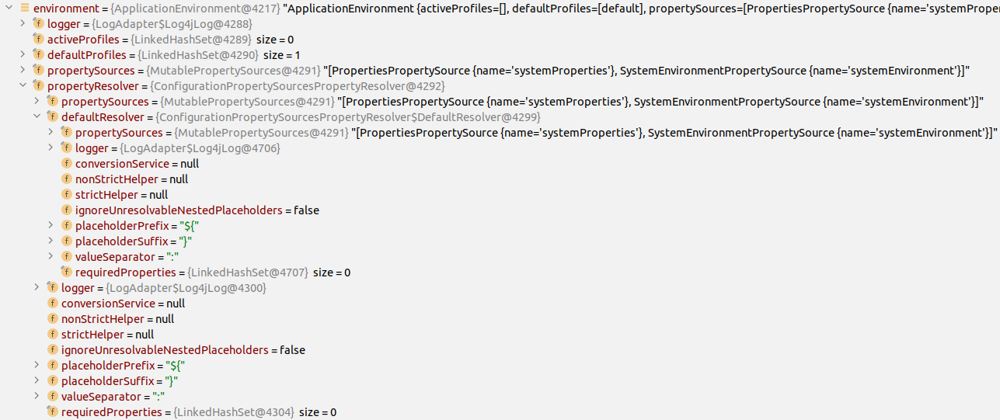

# DevOpsSustain 2025 replication package

This repository contains the replication package of the paper **Energy Codesumption, Leveraging Test Execution for Source Code Energy Consumption Analysis**, submitted at the First International Workshop on DevOps for Sustainability, co-located with FSE 2025.

## Structure of the replication package

This replication package is structured as follows:

```
├── data
|   └── data.csv : CSV file containing the distribution of the analyzed call traces from spoon and spring-boot
├── images: folder containing the images used in this README file
├── plots : folder containing the plots generated by the scripts exported to pdf
└── scripts
    ├── tests : folder containing the unit tests of all the methods used in this repository to analyze the data
    ├── call_trace.py : contains the class CallTrace, representing one call trace
    ├── plotter.py : contains the Plotter class, responsible for the plotting of the data
    └── project_data.py : contains the ProjectData class, representing all the call traces of one project
```

## Getting started

1. Clone this repository
2. Go to the root of the repository
3. Create a new virtual environment: `python3 -m venv .venv`
4. Activate the environment: (for Linux users) `source .venv/bin/activate`
5. Open and execute the `scripts/analysis.ipynb` notebook in an IDE like VSCode
6. Compare the printed results of the execution to the `data.csv` file that contains the mean and standard deviation for each call trace

## Examples of manual call trace analysis

Due to space constraints, we were unable to include exampls of call trace manual analysis in the paper. This section presents two examples, featuring for each a stack trace with each frame linked to its corresponding line number. The association of this stack trace with an energy consumption forms a _call trace_. To enhance clarity, the source code for each frame discussed in the examples will be provided, focusing solely on the relevant lines necessary for understanding each frame.

### Call trace with constructor

For this first example, let's focus on the stack trace below, corresponding to CT1 in the paper.

```
org.[...].propertyResolverIsOptimizedForConfigurationProperties 59
org.[...].ApplicationEnvironmentTests.createEnvironment 30
org.[...].ApplicationEnvironment.<init> 29
```

#### Identification of the method roles

Let's break down this stack trace frame by frame. The first frame is _org.[...].propertyResolverIsOptimizedForConfigurationProperties 59_ and calls the method `propertyResolver IsOptimizedForConfigurationProperties` at the line 59.

```java
@Test
void propertyResolverIsOptimizedForConfigurationProperties() {
    StandardEnvironment environment = createEnvironment(); // Line 59
    ConfigurablePropertyResolver expected = ConfigurationPropertySources
        .createPropertyResolver(new MutablePropertySources());
    assertThat(environment).extracting("propertyResolver").hasSameClassAs(expected);
}
```

The line 59 of the method calls a method named `createEnvironment`, which corresponds to the second frame of the stack trace: _org.[...].ApplicationEnvironmentTests.createEnvironment 30_. Upon reviewing the source code of this method, displayed below, it appears that `createEnvironment` is a **factory**, because it is responsible for the creation of a new object that is returned and used elsewhere.

```java
@Override
protected StandardEnvironment createEnvironment() {
    return new ApplicationEnvironment(); // Line 30
}
```

The line 30 of `createEnvironment` calls a **constructor** of the class `ApplicationEnvironment`, which corresponds to the third frame of the stack trace: _org.[...].ApplicationEnvironment.<init> 29_.

```java
/**
 * {@link StandardEnvironment} for typical use in a typical {@link SpringApplication}.
 *
 * @author Phillip Webb
 */
class ApplicationEnvironment extends StandardEnvironment {  // Line 29
	 //...
}
```

The class `ApplicationEnvironment` has no constructor, so it will call the parent from the `StandardEnvironment` class, another **constructor**, which comes from the compiler. Following the manual analysis of this stack trace, we identified 1 factory and 2 constructor calls for CT1, as detailed in Table IV of the paper.

#### Identification of the number of constructor attributes

To compute the number of attributes of the constructors, let's dig a little more. `StandardEnvironment` has no attribute and extends `AbstractEnvironment`, which is shown below.

```java
public abstract class AbstractEnvironment implements ConfigurableEnvironment {
    public static final String IGNORE_GETENV_PROPERTY_NAME = "spring.getenv.ignore";
    public static final String ACTIVE_PROFILES_PROPERTY_NAME = "spring.profiles.active";
    public static final String DEFAULT_PROFILES_PROPERTY_NAME = "spring.profiles.default";
    protected static final String RESERVED_DEFAULT_PROFILE_NAME = "default";
    protected final Log logger;
    private final Set<String> activeProfiles;
    private final Set<String> defaultProfiles;
    private final MutablePropertySources propertySources;
    private final ConfigurablePropertyResolver propertyResolver;

    public AbstractEnvironment() {
        this(new MutablePropertySources());
    }

    protected AbstractEnvironment(MutablePropertySources propertySources) {
        this.logger = LogFactory.getLog(this.getClass());
        this.activeProfiles = new LinkedHashSet();
        this.defaultProfiles = new LinkedHashSet(this.getReservedDefaultProfiles());
        this.propertySources = propertySources;
        this.propertyResolver = this.createPropertyResolver(propertySources);
        this.customizePropertySources(propertySources);
    }
    // Rest of the code
}
```

This code shows us that `AbstractEnvironment` has 5 non-static attributes, corresponding to the # attr. column CT1 in Table IV of the paper. To compute the total number of hidden attributes, we used a debugger with a break point at the line 60 of the method `propertyResolverIsOptimizedForConfigurationProperties`, just after the first call of the first frame. The outcome of utilizing the debugger is presented below. Due to space constraints, the screenshot does not display all attributes. We can now count the number of hidden attributes utilized in the instantiation of an `ApplicationEnvironment` object. The total number of hidden attribute for this example is 203.



### Call trace without constructor

In this case, the analyzed call trace is CT13 from the paper.

```
spoon.[...].jdt.JDTBasedSpoonCompilerTest.testOrderCompilationUnits 35
spoon.[...].jdt.JDTBasedSpoonCompiler.buildUnits 418
spoon.[...].jdt.JDTBatchCompiler.getUnits 282
spoon.[...].jdt.TreeBuilderCompiler.buildUnits 82
```

Let's break down the stack trace above frame by frame. The first frame _spoon.[...].jdt.JDTBasedSpoonCompilerTest.testOrderCompilationUnits 35_ calls the method `testOrderCompilationUnits` at the line 35.

```java
@Test
public void testOrderCompilationUnits() {
    // Rest of the code

    CompilationUnitDeclaration[] compilationUnitDeclarations = spoonCompiler.buildUnits(null, spoonCompiler.sources, spoonCompiler.getSourceClasspath(), ""); // Line 35

    // Rest of the code
}
```

The line 35 of the `testOrderCompilationUnits` method calls a method named `buildUnits`, which corresponds to the second frame: _spoon.[...].jdt.JDTBasedSpoonCompiler.buildUnits 418_. Upon reviewing the source code of the method below, it appears that `buildUnits` functions as a **builder** method. It is responsible for creating and modifying the internal state of a variable, subsequently invoking the `getUnits` method on that variable to return the result.

```java
/**
 * Build the CompilationUnit found in the source folder
 * @param jdtBuilder The instance of JDTBuilder to prepare the right JDT arguments
 * @param sourcesFolder The source folder
 * @param classpath The complete classpath
 * @param debugMessagePrefix Useful to help debugging
 * @return All compilationUnitDeclaration from JDT found in source folder
 */
protected CompilationUnitDeclaration[] buildUnits(JDTBuilder jdtBuilder, SpoonFolder sourcesFolder, String[] classpath, String debugMessagePrefix) {
    // Rest of the code

    JDTBatchCompiler batchCompiler = createBatchCompiler(new FileCompilerConfig(sourceFiles)); // Creation of an object on which the next method will be called

    // Rest of the code that modifies the batchCompiler variable

    return batchCompiler.getUnits(); // Line 418
}
```

The line 418 of the source code above calls the method `getUnits`, which corresponds to the third frame: _spoon.[...].jdt.JDTBatchCompiler.getUnits 282_. Upon reviewing the source code of this method, we can better understand its role. We have classified this method as a **finder**, as its primary purpose is to search for and return a list of objects from a data structure.

```java
/** Calls JDT to retrieve the list of compilation unit declarations.
 * Depends on the actual implementation of {@link #getCompilationUnits()}
 */
public CompilationUnitDeclaration[] getUnits() {
    // Rest of the code

    TreeBuilderCompiler treeBuilderCompiler = new TreeBuilderCompiler(
        environment, errorHandlingPolicy, compilerOptions, this.jdtCompiler.requestor, problemFactory,
        this.out, jdtCompiler.getEnvironment().getIgnoreSyntaxErrors(), jdtCompiler.getEnvironment().getLevel(),
        new CompilationProgress() {/*...*/});

    // Rest of the code

    final CompilationUnitDeclaration[] result = treeBuilderCompiler.buildUnits(getCompilationUnits()); // Line 282

    // Rest of the code

    return result;
}
```

The line 282 of the `getUnits` method calls the method `buildUnits`, which corresponds to the fourth frame: _spoon.[...].jdt.TreeBuilderCompiler.buildUnits 82_. Please note that this method shares the same name as the second frame but is sourced from a different class. The source code for this method is provided below. We have categorized this method as a **builder** because it modifies the internal state of the `sourceUnits` parameters before invoking another method, `beginToCompile`. This last method, `beginToCompile`, comes from the JDT compiler. As it handles compilation, we classified its role as **lifecycle manager**.

```java
protected CompilationUnitDeclaration[] buildUnits(CompilationUnit[] sourceUnits) {
    // Rest of the code that modifies the state of "sourceUnits"

    beginToCompile(sourceUnits); // Line 82

    // Rest of the code
}
```

Following the analysis of the stack trace, we identified 2 builders, 1 finder and 1 lifecycle manager for CT13, as detailed in Table IV of the paper. Each stack trace discussed in the paper is analyzed through the same process.
